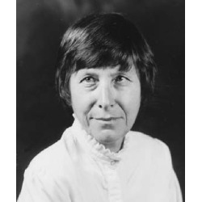

# Judith N. Shklar: Über Ungerechtigkeit (050803)

**Inhalt**

Judith N. Shklar (1928-1992) war eine bedeutende Theoretikerin des politischen Liberalismus und ihr Liberalismus der Furcht ist ein vielzitierter Text in der amerikanischen Debatte. Inzwischen liegt ein Großteil ihres umfangreichen Werkes in deutscher Übersetzung vor.
Über Ungerechtigkeit widmet sich einem unterschätzten politischen und philosophischen Problem und zeigt die Bedeutung der Ungerechtigkeit für den Liberalismus, der eigentlich auf Gerechtigkeitsprinzipien aufbauen sollte..

* Moritz Riemann [riemann@philsem.uni-kiel.de](riemann@philsem.uni-kiel.de) 

* Sprechstundentermine im Sommersemester: **xxx**  |  Boschstraße 1, R. 01.001 | **Keine Anmeldung erforderlich** | Nach Absprache auch digital oder telephonisch unter 0431 880 5644

## "Regierungserklärung"

1. Die Teilnahme am Seminar erfordert die vorbereitende, gründliche Lektüre der Texte.

2. Eine regelmäßige und aktive Teilnahme aller Seminarteilnehmenden ist Voraussetzung für ein gelingendes Seminar.
3. Philosophische Seminare leben vom diskursiven Austausch. Nehmt in Euren Diskussionsbeiträgen auf den Text und aufeinander Bezug, lasst einander ausreden und vermeidet lange, abschweifende Exkurse.
4. Meine Sprechsstunde ist offen für alle Anliegen, es ist keine Anmeldung erforderlich.
5. Bevor Ihr eine Email schreibt: Seht im Seminarplan nach, ob die gesuchte Information dort zu finden ist.

## Zuordnung und Prüfungsleistungen

**Voraussetzungen / Organisatorisches**

* PHF-phil-BA2 (Geschichte der Philosophie: Neuzeit)
* PHF-phil-BA4 (Einführung in die praktische Philosophie)
* PHF-phil-BA6 (Praktische Philosophie – Vertiefung)
* PHF-phil-WP (Philosophische Reflexion und ethische Urteilskraft)

Beachten Sie die Handreichung zum wissenschaftlichen Arbeiten im Fach Philosophie. Jedes Referat, jede Hausarbeit und jeder Essay sind im Vorfeld in der Sprechstunde abzustimmen. Der Abgabetermin für die schriftlichen Prüfungsleistungen ist der ???? . Die Abgabe erfolgt als Ausdruck, mit Deckblatt und unterschriebener Eigenständigkeitserklärung an der Hauptpforte oder im Briefkasten für Prüfungsleistungen in der LS4. Keine Abgabe per Email!

## Semesterplan

| **15.04.2025** | **Eröffnung, Organisatorisches** | **Referat** |
|------------|------------------------------|---------|
| 22.04.2025 | ---- |---  |
| 29.04.2025 | ---| -- |
| 06.05.2025 |  ---| -- |
| 13.05.2025 | ---| -- |
| 20.05.2025 | ---| -- |
| 27.05.2025 |---| -- |
| 03.06.2025 | ---| -- |
| 10.06.2025| ---| -- |
| 17.06.2025 | ---| -- |
| 1.07.2025 |---| -- |
| 08.07.2025| ---| -- |
| 15.07.2025| **Abschlussdiskussion** | -- |

**Prüfungszeitraum des aktuellen Semesters**:
14.07. - 26.07.2025

**2. Prüfungszeitraum**:
06.10. - 18.10.2025

**Termine für die Anmeldung zum 1. Prüfungszeitraum (1. PZ)**

* Beginn: Montag 2.06.2025
* Ende: Sonntag 29.06.2025

**Termine für die Anmeldung  zum 2. Prüfungszeitraum (2. PZ)**

* Beginn: 25.08.2025
* Ende: 21.09.2025

## 1. Sitzung am 15.04.2025

**Name:** Judith Nisse Shklar  

 **Geboren:** 24. September 1928 in Riga, Lettland 
 
**Gestorben:** 17. September 1992 in Cambridge, Massachusetts, USA  

**Beruf:** Politikwissenschaftlerin und politische Theoretikerin  

## **Leben**:

- **Herkunft und Flucht:** 
Geboren in eine deutschsprachige jüdische Familie, floh sie 1939 mit ihrer Familie vor den Nationalsozialisten und Sowjets über die Transsibirische Eisenbahn nach Kanada.  

- **Bildung:** 
Studium der Politikwissenschaft an der McGill University in Montreal; Promotion an der Harvard University (1955).  

- **Karriere:** 
Erste Frau auf einer Festanstellung im Fachbereich Politische Wissenschaften an der Harvard University. Sie lehrte dort bis zu ihrem Tod und wurde 1980 zur „John Cowles Professor of Government“ ernannt.

---
## **Philosophisches Denken**:

 **"Liberalismus der Furcht"**:

   - Ihr bekanntestes Konzept, das sie in ihrem Essay *The Liberalism of Fear* (1989) darlegte.

   - Zentraler Gedanke: Der Liberalismus soll vor allem Grausamkeit und Machtmissbrauch verhindern. Freiheit bedeutet für sie, ohne Furcht Entscheidungen treffen zu können.

   - Sie plädiert für eine liberale Demokratie, die Macht begrenzt und verteilt.

 **Fokus auf Ungerechtigkeit**:

   - In *Über Ungerechtigkeit* (1990) kritisiert sie, dass Philosophen oft nur Gerechtigkeit analysieren und das Thema Ungerechtigkeit vernachlässigen.

   - Sie betont die Bedeutung von Ungerechtigkeit als eigenständiges philosophisches Problem.

 **Ablehnung von Utopien**:

   - In ihrem Werk *After Utopia* (1957) kritisiert sie politische Ideologien, die sich auf utopische Zukunftsvisionen stützen, da diese oft die Gegenwart ignorieren.

4. **Moralische Urteilskraft**:

   - Shklar betont die Bedeutung individueller Urteilskraft in einer Welt ohne absolute Sicherheiten oder universelle Regeln.
---
## **Wichtige Werke**:
- *After Utopia: The Decline of Political Faith* (1957)  
- *Ordinary Vices* (*Ganz normale Laster*, 1984)  
- *The Liberalism of Fear* (*Der Liberalismus der Furcht*, 1989)  

- *Faces of Injustice* (*Über Ungerechtigkeit*, 1990)

Judith Shklar hat mehrere einflussreiche Werke verfasst, die ihre zentrale Rolle in der politischen Theorie und Liberalismus-Debatte unterstreichen. Zu den wichtigsten zählen:
**Der Liberalismus der Furcht (1989)**
- Dieses Werk ist ihr bekanntestes und prägendstes. Es formuliert eine liberale Theorie, die darauf abzielt, Grausamkeit und Machtmissbrauch zu verhindern. Shklar argumentiert, dass der Liberalismus vor allem die Freiheit sichern sollte, ohne Furcht Entscheidungen treffen zu können. Sie befürwortet eine konstitutionelle Demokratie, die Macht begrenzt und verteilt.

**Ganz normale Laster (1984)**
- In diesem Buch untersucht Shklar alltägliche moralische Schwächen wie Grausamkeit, Heuchelei und Feigheit. Sie stellt Grausamkeit als das größte Übel (*summum malum*) dar und verbindet dies mit ihrer liberalen Theorie. Das Werk bietet eine tiefgehende Reflexion über die moralischen Grundlagen des politischen Handelns.

**Über Ungerechtigkeit (1990)**
- In diesem Werk kritisiert Shklar die philosophische Vernachlässigung des Konzepts der Ungerechtigkeit zugunsten von Gerechtigkeitstheorien. Sie analysiert verschiedene Formen von Ungerechtigkeit (z. B. passive und aktive Ungerechtigkeit) und betont deren zentrale Bedeutung für politische und soziale Theorie.

**After Utopia: The Decline of Political Faith (1957)**
- Dieses frühe Werk kritisiert utopisches Denken in der politischen Theorie und plädiert für eine realistische Betrachtung politischer Möglichkeiten. Es zeigt Shklars Skepsis gegenüber Ideologien, die auf idealisierten Zukunftsvisionen basieren.

**Essays über Hannah Arendt**
- Ihre kritischen Texte über Hannah Arendt beleuchten Unterschiede in den Denkansätzen der beiden Philosophinnen, insbesondere in Bezug auf Exil, Freiheit und politische Romantik. Diese Essays sind besonders relevant für das Verständnis von Shklars Position im Vergleich zu anderen großen politischen Theoretikern[2].
Diese Werke prägen bis heute Debatten über Liberalismus, Gerechtigkeit und politische Ethik und machen Judith Shklar zu einer der bedeutendsten Denkerinnen des 20. Jahrhunderts.

---
### **Bedeutung**:
Judith Shklar gilt als eine der bedeutendsten liberalen Theoretikerinnen des 20. Jahrhunderts. Ihre Arbeiten haben bis heute Einfluss auf Debatten über politische Ethik, Machtbegrenzung und die Rolle von Freiheit in einer liberalen Gesellschaft.

### **Sonstige Literatur (Auswahl)**: 
-	Hannes Bajohr und Rieke Trimçev: Judith N. Shklar. Leben – Werk – Gegenwart
-	Themenheft zur Shklars politischer Philosophie: https://shop.budrich.de/wp-content/uploads/2022/01/1869-3016-2018-2.pdf
- Trimçev, Rieke: [Verbindlichkeitskonflikte und politische Verpflichtung](https://www.ssoar.info/ssoar/bitstream/handle/document/66276/ssoar-zpth-2018-2-trimcev-Verbindlichkeitskonflikte_und_politische_Verpflichtung.pdf?sequence=2&isAllowed=y&lnkname=ssoar-zpth-2018-2-trimcev-Verbindlichkeitskonflikte_und_politische_Verpflichtung.pdf)

### **Judith Shklar im Netz (Auswahl)**: 
-	Die politische Philosophie der Judith N. Shklar - Liberalismus ohne Illusionen: https://www.br.de/mediathek/podcast/radiowissen/die-politische-philosophie-der-judith-n-shklar-liberalismus-ohne-illusionen/1853684

-	Judith N. Shklar: „Über Hannah Arendt“. Kritik unter Geistesgrößen: https://www.deutschlandfunkkultur.de/judith-n-shklar-ueber-hannah-arendt-kritik-unter-100.html
- Buchkritik von H. Bajohr: https://www.deutschlandfunkkultur.de/buchkritik-ad-judith-n-shklar-von-hannes-bajohr-rieke-trimcev-dlf-kultur-6782831d-100.html

### **Podcastsendungen (Auswahl)**: 
-	Podcast Filosofie: Judith Shklar https://podcasts.apple.com/de/podcast/judith-shklar/id1451841760?i=1000646349383

-	Required Reading from: Liberalism of Fear by Judith Shklar: https://podcasts.apple.com/de/podcast/liberalism-of-fear-by-judith-shklar/id1786599014?i=1000681133134 

-	SWR. Das Wissen: Die Politologin Judith Shklar: https://podcasts.apple.com/de/podcast/die-politologin-judith-nisse-shklar-wie-demokratien/id104913043?i=1000501341831 

-	Talking Politics: Shklar on Hypocrisy: https://podcasts.apple.com/de/podcast/shklar-on-hypocrisy/id1508992867?i=1000517869772

